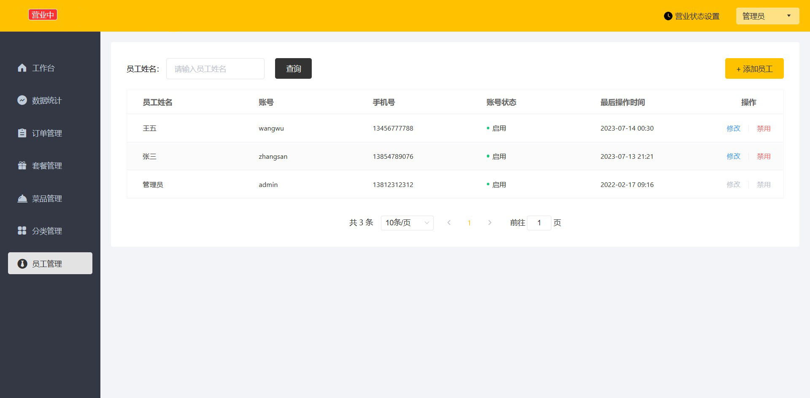
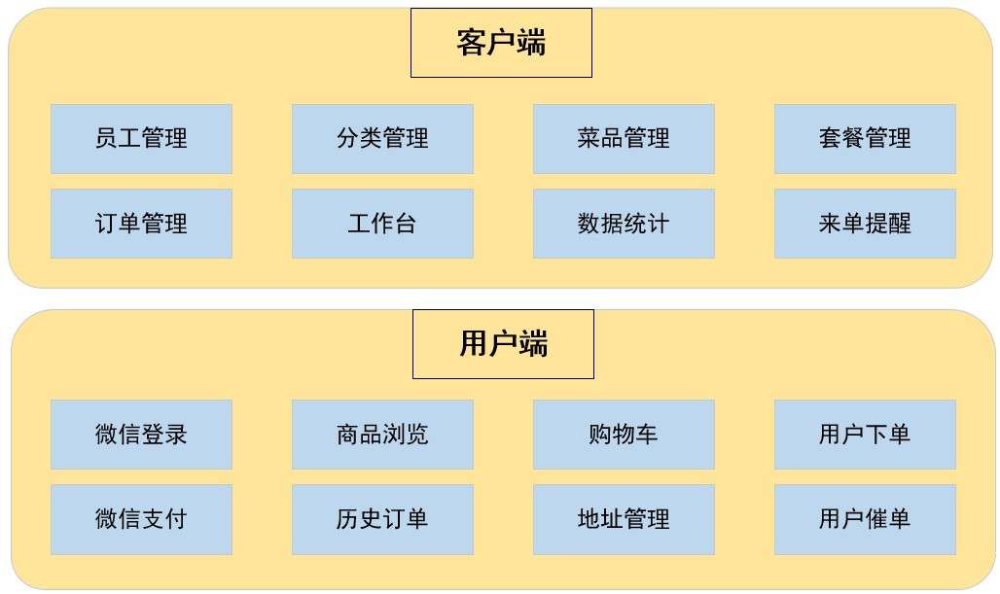
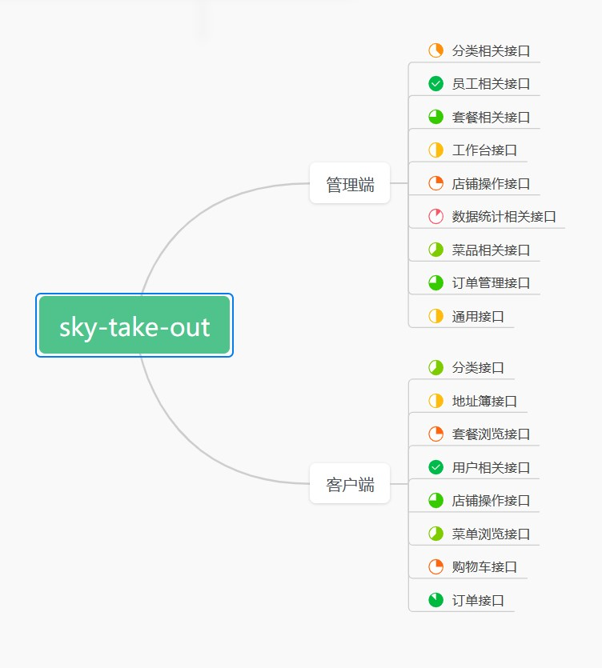

# sky-take-out

## 项目介绍
`sky-take-out`项目是一套基于时下最流行的技术栈 `Spring Boot + Vue` 开发的前后端分离的点餐外卖系统,
且此系统是专门为餐饮企业定制的。系统整体分为外卖商家使用的管理端以及顾客使用的用户端，主要包含菜品套餐管理，订单处理，员工管理，商品的浏览、下单以及支付等功能。

### 项目展示
#### 后台管理系统

### 开发工具

| 工具      | 说明           | 官网                                      |
|---------|--------------|-----------------------------------------|
| IDEA    | 开发IDE        | https://www.jetbrains.com/idea/download |
| Navicat | 数据库管理工具      | http://www.formysql.com/xiazai.html     |
| Knife4J | API接口文档生成及调试 | https://github.com/xiaoymin/knife4j     |
| Notion  | Markdown编辑器  | https://www.notion.so/                  |

### 开发环境

| 环境    | 版本号    | 下载                                                                                   |
|-------|--------|--------------------------------------------------------------------------------------|
| JDK   | 17.0.3 | https://www.oracle.com/technetwork/java/javase/downloads/jdk8-downloads-2133151.html |
| Mysql | 8.0.29 | https://www.mysql.com/                                                               |
| Redis | 5.0.14 | https://redis.io/download                                                            |                                      
| Nginx | 1.20   | http://nginx.org/en/download.html                                                    |          

## 技术选型
### 后端技术
| 技术           | 说明          | 官网                                             |
|--------------|-------------|------------------------------------------------|
| Spring Boot  | 基础框架        | https://spring.io/projects/spring-boot         |
| Spring MVC   | MVC框架       | https://spring.io/projects/spring-boot         |
| Spring Data  | 数据访问框架      | https://spring.io/projects/spring-data         |
| Spring Task  | 定时任务管理      | https://spring.io/guides/gs/scheduling-tasks/  |
| Spring Cache | 应用层缓存       | https://spring.io/guides/gs/caching/           |
| MyBatis      | ORM框架       | http://www.mybatis.org/mybatis-3/zh/index.html |
| Redis        | 缓存数据库       | https://redis.io/                              |
| Nginx        | 静态资源服务器     | https://www.nginx.com/                         |
| Druid        | 数据库连接池      | https://github.com/alibaba/druid               |
| OSS          | 对象存储        | https://github.com/aliyun/aliyun-oss-java-sdk  |
| JWT          | JWT权限校验     | https://github.com/jwtk/jjwt                   |
| Lombok       | 简化对象封装工具    | https://github.com/rzwitserloot/lombok         |
| PageHelper   | MyBatis分页插件 | http://git.oschina.net/free/Mybatis_PageHelper |
| Swagger      | 文档生成工具      | https://github.com/swagger-api/swagger-ui      |    

### 前端技术

| 技术         | 说明        | 官网                                                          |
|------------|-----------|-------------------------------------------------------------|
| Node.js    | 服务端js运行环境 | https://nodejs.org/                                         |
| Vue        | 前端框架      | https://vuejs.org/                                          |
| Vue-router | 路由框架      | https://router.vuejs.org/                                   |
| Vuex       | 全局状态管理框架  | https://vuex.vuejs.org/                                     |
| 微信小程序      | 前端框架      | https://developers.weixin.qq.com/miniprogram/dev/framework/ |
| Element    | 前端UI框架    | https://element.eleme.io                                    |
| Axios      | 前端HTTP框架  | https://github.com/axios/axios                              |
## 系统架构
### 功能模块图

## 开发进度
### 开发进度表

附:1.[SQL文件](https://github.com/hua-cloud/sky-take-out/blob/master/sky-server/src/main/resources/sql/sky.sql)
2.[数据库设计文档](https://github.com/hua-cloud/sky-take-out/blob/master/sky-server/src/main/resources/sql/%E6%95%B0%E6%8D%AE%E5%BA%93%E8%AE%BE%E8%AE%A1%E6%96%87%E6%A1%A3.md)
